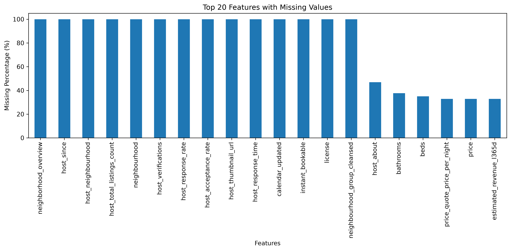
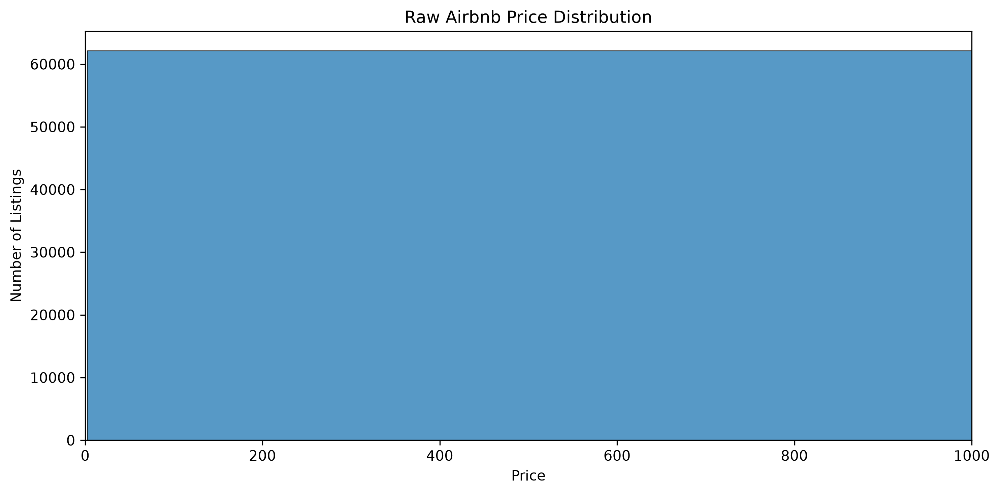
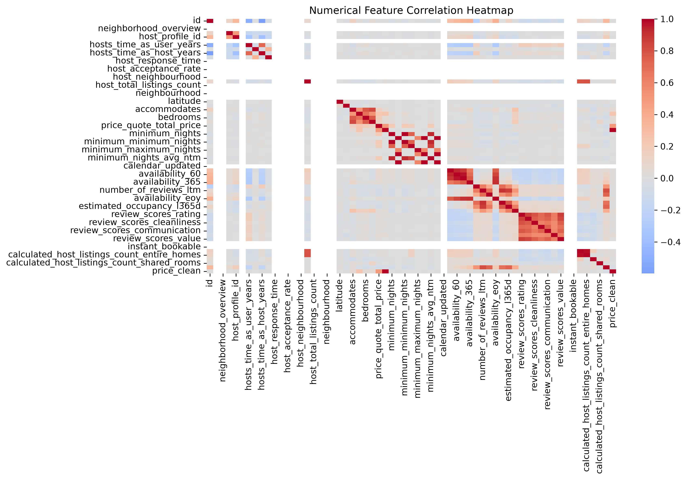
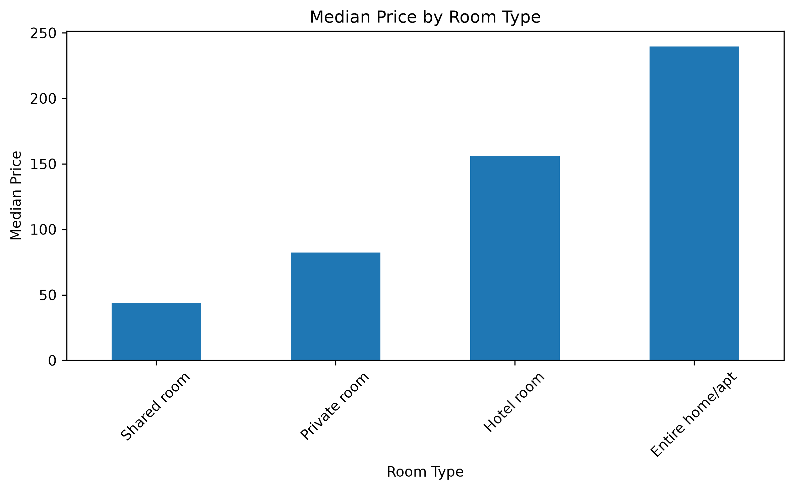
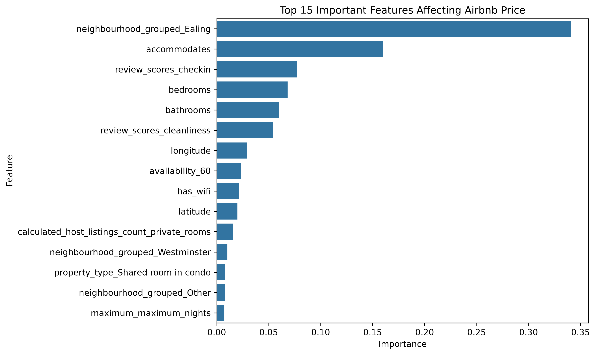
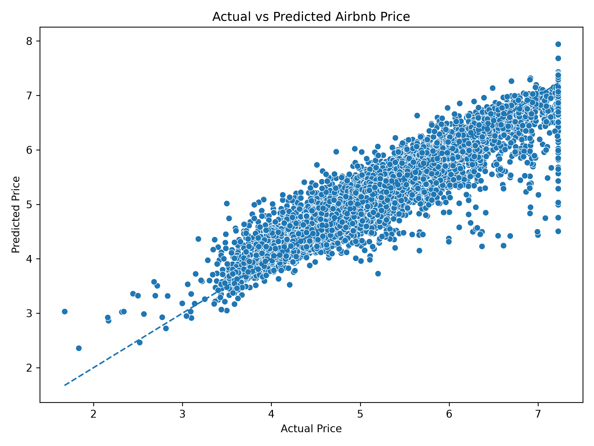
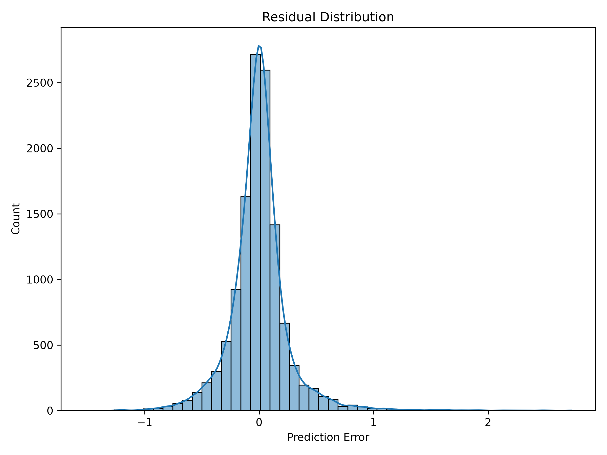
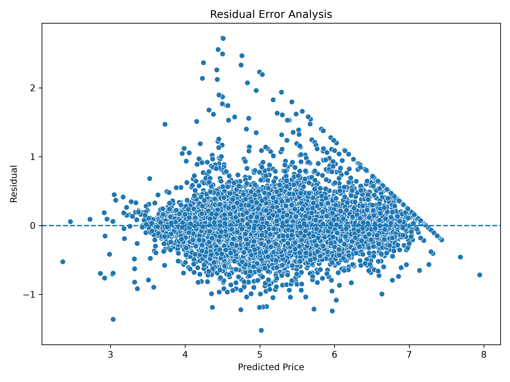

# Airbnb Price Prediction Using Machine Learning

## CSE437: Data Science Project Report

### Course Information

**Course:** CSE437 - Data Science  
**Section:** 6  
**Semester:** Summer 2026

### Group Members

| Name | Student ID |
|---|---|
| Saptarshi Barman | 22301750 |
| Mahi Al Mahbub | 22101840 |

### GitHub Repository

[cse437-airbnb-price-prediction-group-16](https://github.com/Sap7arshi7/cse437-airbnb-price-prediction-group-16)

### Submission Date

3 September 2026

---

## Summary

Airbnb has become one of the largest online accommodation platforms, where accurate pricing is important for attracting guests and supporting host revenue. However, listing prices depend on many interacting factors, including property characteristics, location, host information, availability, and reviews. These relationships make manual price estimation difficult.

This project develops a machine-learning regression system for predicting Airbnb listing prices using the London Detailed Listings dataset from Inside Airbnb [1]. The work follows a complete data science workflow: data auditing, exploratory data analysis, preprocessing, feature engineering, baseline modeling, hyperparameter tuning, and error analysis. Data preparation was completed with pandas [3], while the regression models and evaluation workflow were implemented with scikit-learn [2].

Three regression algorithms were evaluated: Linear Regression, Random Forest Regressor, and Gradient Boosting Regressor. The Gradient Boosting model was then optimized through three-fold grid-search cross-validation. The tuned model achieved the strongest test performance, with a mean absolute error (MAE) of 0.169968, root mean squared error (RMSE) of 0.268806, and R² score of 0.881761. These error values were calculated on the log-transformed price target. The results show that machine-learning models can capture much of the variation in London Airbnb listing prices, although high-priced listings remain more difficult to predict.

---

## 1. Problem and Dataset

### 1.1 Problem Statement

Airbnb listing prices are influenced by property capacity, room type, location, host characteristics, availability, and review information. Because these factors interact in nonlinear ways, accurately estimating an appropriate listing price manually can be difficult.

The objective of this project is to build a supervised regression system that predicts the price of a London Airbnb listing from its available attributes. The project also examines which features contribute most to the prediction, how the data-preparation steps support model development, and which evaluated model produces the lowest prediction error.

### 1.2 Dataset

| Item | Details |
|---|---|
| Dataset | London Airbnb Detailed Listings Dataset |
| Provider | Inside Airbnb |
| Source | [Inside Airbnb: Get the Data](https://insideairbnb.com/get-the-data/) |
| Raw size | 92,638 rows and 90 columns |
| Rows retained after price cleaning | 62,240 |

The dataset contains real-world information about property details, hosts, locations, room types, availability, reviews, amenities, and prices. It was suitable for this project because it contains numerical and categorical variables, missing values, skewed prices, and attributes that require careful preprocessing.

The raw file is expected at `data/raw/listings.csv`. It is kept unchanged so that the preprocessing workflow remains reproducible. Files generated by the preprocessing stage are stored in `data/processed/`.

### 1.3 Target Variable

The prediction target is `log_price`. First, the original `price` text was converted to a numerical value by removing currency symbols and commas. Prices above the 99th percentile were capped to reduce the influence of extreme outliers. The final target was then calculated as:

`log_price = log(1 + capped_price)`

The logarithmic transformation reduces right skew and helps the models learn the overall pricing pattern. Consequently, the reported MAE and RMSE values describe error on the transformed scale rather than error directly in pounds.

### 1.4 Research Questions

1. Which property, location, host, and review-related features have the strongest relationship with Airbnb listing prices in London?
2. How do data preprocessing and feature selection support the performance of Airbnb price-prediction models?
3. Which machine-learning model provides the most accurate predictions after hyperparameter tuning, and what types of listings produce the largest errors?

---

## 2. Data Handling and Preprocessing

### 2.1 Data Quality Audit

The first stage examined the dataset dimensions, data types, missing values, duplicates, numerical summaries, and feature distributions. This audit identified completely empty columns, partially missing attributes, text-based price values, and variables that could create target leakage.

*Figure 1. Top 20 features with the highest missing-value percentages in the raw dataset.*

The audit guided the later decisions to remove unusable fields, impute missing values, and exclude price-derived predictors.

### 2.2 Missing-Value Handling

Listings with a missing or non-positive target price were removed because they could not be used for supervised training. Completely empty columns were also removed. For the remaining predictors:

- Missing numerical values were replaced with the median of the corresponding feature.
- Missing categorical values were assigned the label `Unknown`.
- A final check confirmed that the model input files contained no unresolved missing values.

This approach retained useful rows while avoiding the loss of large portions of the dataset.

### 2.3 Data Cleaning and Transformation

The main preprocessing operations were:

- converting price strings into numerical values;
- capping prices at the 99th percentile and applying a `log1p` transformation;
- removing identifiers, URLs, free-text fields, empty columns, and other unsuitable attributes;
- converting selected amenity information into binary indicators;
- grouping less frequent neighbourhoods under `Other`;
- mapping binary true/false variables to 1 and 0;
- one-hot encoding property type, room type, and grouped neighbourhood; and
- removing price-derived features that could leak target information.

These steps transformed the raw listings into a fully numerical dataset suitable for regression models.

### 2.4 Train-Test Split

The cleaned dataset was divided with `random_state=42` to make the split reproducible.

| Subset | Percentage | Rows |
|---|---:|---:|
| Training set | 80% | 49,792 |
| Test set | 20% | 12,448 |
| Total | 100% | 62,240 |

The test set was kept separate from model fitting and hyperparameter selection. Three-fold cross-validation on the training set was later used during grid search.

The generated files are:

- `data/processed/X_train.csv`
- `data/processed/X_test.csv`
- `data/processed/y_train.csv`
- `data/processed/y_test.csv`

### 2.5 Before and After Preprocessing

| Processing area | Before | After |
|---|---|---|
| Target price | Currency-formatted and skewed | Cleaned, capped, and log-transformed |
| Missing values | Present in multiple features | Imputed or removed according to feature type |
| Categorical features | Text-based categories | Binary or one-hot encoded |
| Rare neighbourhoods | Many individual categories | Less frequent values grouped as `Other` |
| Leakage risk | Price-derived predictors present | Leakage-prone predictors removed |
| Model input | Raw listing information | 160 numerical predictors |

---

## 3. Statistical Analysis

### 3.1 Descriptive Statistics

Descriptive statistics, including the mean, standard deviation, minimum, maximum, and quartiles, were inspected for numerical variables. The raw price distribution showed a long right tail, supporting the decision to cap extreme values and transform the target.

*Figure 2. Distribution of raw Airbnb listing prices before target transformation.*

### 3.2 Feature-Relationship Analysis

A correlation heatmap was used to inspect linear relationships among numerical variables. It helped identify groups of related availability, review, capacity, and host-listing features, although correlation alone does not establish causation or fully describe nonlinear effects.

*Figure 3. Correlation heatmap for the numerical features in the raw dataset.*

Room type also showed a clear pricing pattern. Entire homes or apartments had the highest median price, followed by hotel rooms, private rooms, and shared rooms.

*Figure 4. Median Airbnb listing price for each room-type category.*

### 3.3 Statistical Observations

The exploratory analysis produced three main observations:

- prices were strongly right-skewed before transformation;
- property capacity and location were important sources of price variation; and
- several predictors had nonlinear or interacting relationships, supporting the use of tree-based ensemble models.

---

## 4. Feature Engineering

### 4.1 Feature Preparation

Feature engineering converted the cleaned data into a consistent numerical representation. Train and test columns were aligned in the same order, and any missing encoded category in the test set was added with a value of zero. Extreme night-limit fields and price-derived variables were reviewed and removed where they could introduce unstable or unrealistic patterns.

### 4.2 Feature Selection and Importance

The Gradient Boosting model's feature-importance values were used to inspect which predictors contributed most to its decisions. The strongest features included the Ealing neighbourhood indicator, accommodation capacity, check-in review score, number of bedrooms, number of bathrooms, and cleanliness review score.

*Figure 5. Top 15 feature importances produced by the Gradient Boosting model.*

These importances are model-specific measures of predictive contribution; they should not be interpreted as proof that a feature directly causes a price change.

### 4.3 Leakage Prevention

Price-derived predictors, including quoted-price fields, were excluded from the final feature set. Without this step, a model could appear accurate by using information that would not be available in a realistic price-prediction setting. Preventing leakage therefore makes the test results more credible.

### 4.4 Final Feature Set

The final training and test matrices each contain 160 aligned numerical predictors. These files were used consistently by all baseline models, the grid search, and the final evaluation notebook.

---

## 5. Modeling and Validation

### 5.1 Validation Strategy

All baseline models were trained on the 80% training subset and evaluated on the untouched 20% test subset. Hyperparameter selection used three-fold cross-validation within the training data. This separation reduced the risk of selecting parameters based directly on test-set performance and follows standard supervised-learning practice [4].

### 5.2 Baseline Models

#### Linear Regression

Linear Regression provided a simple reference model. It assumes an approximately linear relationship between the predictors and the log-transformed target.

#### Random Forest Regressor

Random Forest combines many decision trees and averages their outputs. It can capture nonlinear relationships and interactions without requiring a linear feature relationship.

#### Gradient Boosting Regressor

Gradient Boosting builds trees sequentially, with each new tree focusing on errors made by the earlier trees. Although its untuned baseline did not outperform Random Forest, it was selected for grid search because its learning rate, tree depth, and number of estimators provide useful control over model complexity.

### 5.3 Evaluation Metrics

#### Mean Absolute Error (MAE)

MAE is the average absolute difference between the actual and predicted `log_price` values. Lower values indicate smaller average errors.

#### Root Mean Squared Error (RMSE)

RMSE gives greater weight to large prediction errors. Lower values indicate better performance.

#### R² Score

R² measures the proportion of target variation explained by the model. Values closer to 1 indicate stronger predictive performance.

### 5.4 Baseline Model Comparison

| Model | MAE | RMSE | R² Score |
|---|---:|---:|---:|
| Linear Regression | 0.2927 | 0.3961 | 0.7432 |
| Random Forest Regressor | 0.2107 | 0.3128 | 0.8399 |
| Gradient Boosting Regressor | 0.2511 | 0.3481 | 0.8017 |

Random Forest produced the strongest untuned baseline. Gradient Boosting was nevertheless carried forward to determine whether systematic tuning could improve its performance beyond the baseline models.

---

## 6. Hyperparameter Tuning

### 6.1 Tuning Method

`GridSearchCV` evaluated eight Gradient Boosting configurations through three-fold cross-validation. Negative RMSE was used as the scoring function, so the selected configuration was the one with the lowest average validation RMSE.

### 6.2 Search Space

| Parameter | Tested values |
|---|---|
| `n_estimators` | 100, 200 |
| `learning_rate` | 0.05, 0.1 |
| `max_depth` | 3, 5 |

### 6.3 Best Parameters

| Parameter | Selected value |
|---|---:|
| `n_estimators` | 200 |
| `learning_rate` | 0.1 |
| `max_depth` | 5 |

### 6.4 Tuned Model Performance

| Metric | Test score |
|---|---:|
| MAE | 0.169968 |
| RMSE | 0.268806 |
| R² Score | 0.881761 |

The tuned Gradient Boosting model improved on both its untuned baseline and the Random Forest baseline across all three metrics.

---

## 7. Results, Visualizations, and Error Analysis

### 7.1 Final Test Performance

The tuned Gradient Boosting Regressor was selected as the final model. Its R² score of 0.881761 indicates that it explained approximately 88.18% of the variation in the test-set `log_price` values. Because the target was transformed, this percentage describes variation on the log-price scale.

### 7.2 Actual versus Predicted Values

The actual-versus-predicted plot shows a strong positive alignment around the dashed equality line. The spread becomes wider for some high-price cases, indicating that the model is less consistent for unusual listings.

*Figure 6. Actual versus predicted log-transformed prices; the dashed line represents perfect predictions.*

### 7.3 Residual Analysis

Residuals were calculated as actual `log_price` minus predicted `log_price`. Their mean was approximately 0.0010, which is close to zero and suggests little overall signed bias. However, a small number of high-priced listings produced much larger positive residuals, meaning that their prices were underestimated.

*Figure 7. Distribution of residuals for the final model on the test set.*

*Figure 8. Residuals plotted against predicted log-transformed prices; the dashed horizontal line marks zero error.*

### 7.4 Answers to the Research Questions

#### Research Question 1

**Which property, location, host, and review-related features have the strongest relationship with Airbnb listing prices in London?**

The model-specific importance analysis identified neighbourhood, accommodation capacity, check-in review score, bedrooms, bathrooms, cleanliness score, longitude, and availability among the leading predictors. Room-type medians also showed a clear price ordering, with entire homes or apartments having the highest median price.

#### Research Question 2

**How do data preprocessing and feature selection support the performance of Airbnb price-prediction models?**

Preprocessing produced a complete numerical feature matrix by cleaning the target, imputing missing values, encoding categorical variables, grouping rare categories, and removing leakage-prone features. These operations made consistent model training possible and improved the credibility of the evaluation. However, the project did not perform a separate ablation study, so the individual performance gain from each preprocessing step cannot be quantified.

#### Research Question 3

**Which machine-learning model provides the most accurate predictions after hyperparameter tuning, and what types of listings produce the largest errors?**

The tuned Gradient Boosting Regressor achieved the best overall performance, with an MAE of 0.169968, RMSE of 0.268806, and R² score of 0.881761. The largest absolute errors mainly occurred for listings with unusually high log-price values, which the model tended to underestimate.

---

## 8. Limitations and Next Steps

The project has several limitations:

- The data represents London only, so the model may not generalize to other cities.
- The dataset is a single market snapshot and does not explicitly model seasonal demand, special events, or economic changes.
- MAE and RMSE are reported on the log-price scale and do not directly show average error in pounds.
- High-priced and unusual listings remain harder to predict because comparable examples are less common.
- The project did not use an ablation study to measure each preprocessing step independently.

Future work could include multiple cities, time-based validation, seasonal and event features, prediction intervals, error reporting after reversing the log transformation, and additional ensemble methods.

---

## 9. Contributions

| Member | Student ID | Contribution |
|---|---|---|
| Saptarshi Barman | 22301750 | Data preprocessing, feature engineering, model development, hyperparameter tuning, and evaluation analysis |
| Mahi Al Mahbub | 22101840 | Exploratory data analysis, visualization, documentation, report preparation, and repository organization |

---

## 10. Conclusion

This project developed a machine-learning regression system for predicting London Airbnb listing prices. The workflow covered data auditing, preprocessing, feature engineering, baseline comparison, hyperparameter tuning, and error analysis.

Among the evaluated models, the tuned Gradient Boosting Regressor achieved the strongest test performance, with an MAE of 0.169968, RMSE of 0.268806, and R² score of 0.881761 on the log-transformed target. The results demonstrate that property, location, capacity, and review-related information can explain a large share of the variation in listing prices. The residual analysis also shows that unusual high-price listings require further attention in future work.

---

## References

[1] Inside Airbnb, “Get the Data.” [Online]. Available: [https://insideairbnb.com/get-the-data/](https://insideairbnb.com/get-the-data/). Accessed: Sep. 1, 2026.

[2] F. Pedregosa *et al*., “Scikit-learn: Machine Learning in Python,” *Journal of Machine Learning Research*, vol. 12, no. 85, pp. 2825–2830, 2011. [Online]. Available: [https://jmlr.org/papers/v12/pedregosa11a.html](https://jmlr.org/papers/v12/pedregosa11a.html).

[3] W. McKinney, “Data Structures for Statistical Computing in Python,” in *Proceedings of the 9th Python in Science Conference (SciPy 2010)*, 2010, pp. 56–61, doi: [10.25080/Majora-92bf1922-00a](https://doi.org/10.25080/Majora-92bf1922-00a).

[4] A. Géron, *Hands-On Machine Learning with Scikit-Learn, Keras, and TensorFlow*, 2nd ed. Sebastopol, CA, USA: O’Reilly Media, 2019.
